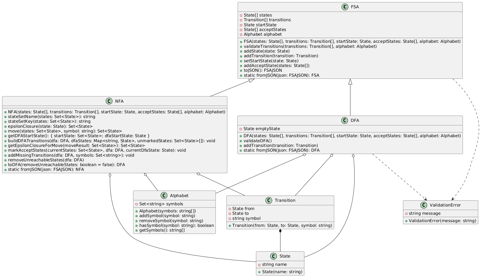

# Otomat

**Otomat** is a TypeScript library for working with Finite State Automata (FSA), specifically for converting Non-deterministic Finite Automata (NFA) to Deterministic Finite Automata (DFA).

## Installation

To install the library, use npm or yarn:

```bash
npm install otomat
pnpm add otomat
```

## Usage

Here’s a basic example of how to create an NFA, convert it to a DFA, and interact with the automaton:

```typescript
import { NFA, State, Transition, Alphabet } from "otomat";

// Define states
const q0: State = "q0";
const q1: State = "q1";

// Define alphabet
const alphabet: Alphabet = ["a", "b"];

// Define transitions
const transitions: Transition[] = [
  { from: q0, to: q1, symbol: "a" },
  { from: q1, to: q0, symbol: "b" },
  { from: q0, to: q0, symbol: "ε" },
];

// Create NFA
const nfa = new NFA([q0, q1], transitions, q0, [q1], alphabet);

// Convert NFA to DFA
const dfa = nfa.toDFA();
```

### Converting NFA to DFA with `removeUnreachableStates` set to `true`

In some cases, you may want to remove states that cannot be reached from the start state during the NFA to DFA conversion:

```typescript
import { NFA, State, Transition, Alphabet } from "otomat";

// Define states
const q0: State = "q0";
const q1: State = "q1";
const q2: State = "q2"; // Unreachable state

// Define alphabet
const alphabet: Alphabet = ["a", "b"];

// Define transitions
const transitions: Transition[] = [
  { from: q0, to: q1, symbol: "a" },
  { from: q1, to: q0, symbol: "b" },
  { from: q0, to: q0, symbol: "ε" },
];

// Create NFA with an unreachable state
const nfa = new NFA([q0, q1, q2], transitions, q0, [q1], alphabet);

// Convert NFA to DFA and remove unreachable states
const dfa = nfa.toDFA(true);
```

In this example, the state `q2` will be removed during the conversion since it is unreachable from the start state `q0`.

### Using AutomataCreator to create an FSA from JSON

You can create an FSA (either DFA or NFA) directly from a JSON representation using the `AutomataCreator`:

```typescript
import { AutomataCreator, FSAJSON } from "otomat";

// Define a JSON representation of an NFA
const nfaJson: FSAJSON = {
  states: ["q0", "q1"],
  transitions: [
    { from: "q0", to: "q1", symbol: "a" },
    { from: "q1", to: "q0", symbol: "b" },
    { from: "q0", to: "q0", symbol: "ε" },
  ],
  startState: "q0",
  acceptStates: ["q1"],
  alphabet: ["a", "b"],
};

// Create an NFA or DFA based on the JSON structure
const automaton = AutomataCreator.createFromJSON(nfaJson);
```

## Architecture Diagram

The following UML diagram illustrates the architecture of the library:



## Contributing

Contributions are welcome! Please feel free to submit a Pull Request or open an issue on GitHub.
